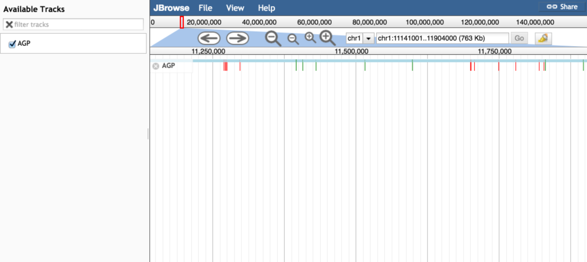

# agp_parser

A JBrowse plugin to parse AGP files

Figure. Gaps of known size are given a green color and gaps of unknown size are colored red

## Reference

https://www.ncbi.nlm.nih.gov/assembly/agp/AGP_Specification/

## Installation

Download the plugin to plugins/AGPParser and add "plugins": ["AGPParser"] to the config or similar

## Configuration

See test/data/trackList.json and test/data/functions.conf for coloring functions
