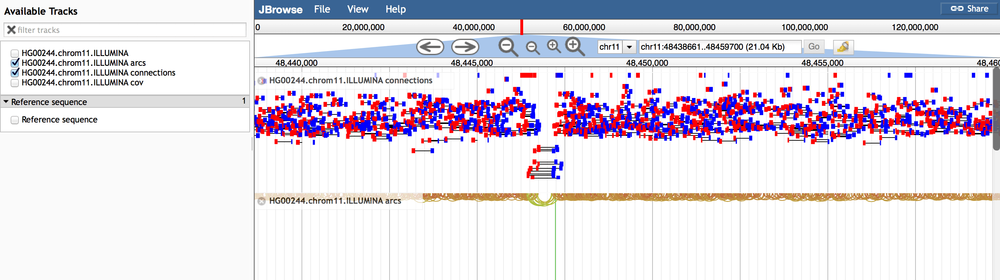

# pairedreadviewer

A JBrowse plugin for drawing PairedEndReads with various different types of feature glyphs.

    {
        "overridePlugins" : true,
        "storeClass" : "JBrowse/Store/SeqFeature/BAM",
        "urlTemplate" : "HG00244.chrom11.ILLUMINA.bwa.GBR.low_coverage.20121211.bam",
        "type" : "JBrowse/View/Track/CanvasFeatures",
        "glyph" : "PairedReadViewer/View/FeatureGlyph/PairedArc",
        "maxFeatureScreenDensity": 60,
        "label" : "HG00244.chrom11.ILLUMINA arcs"
    }

## Screenshots

